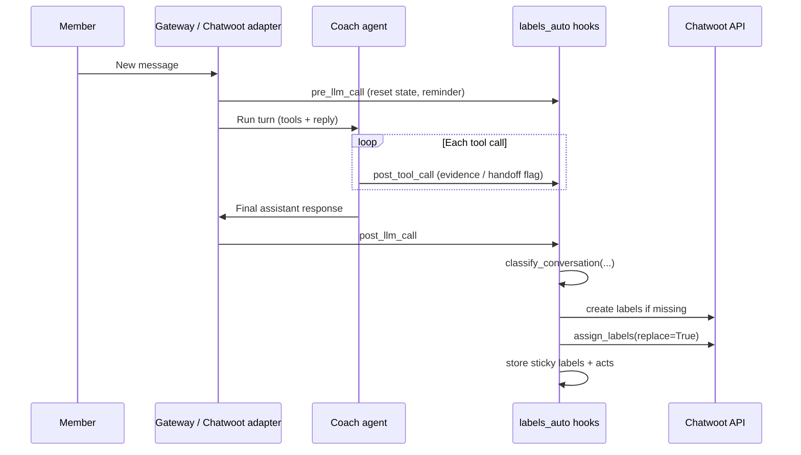
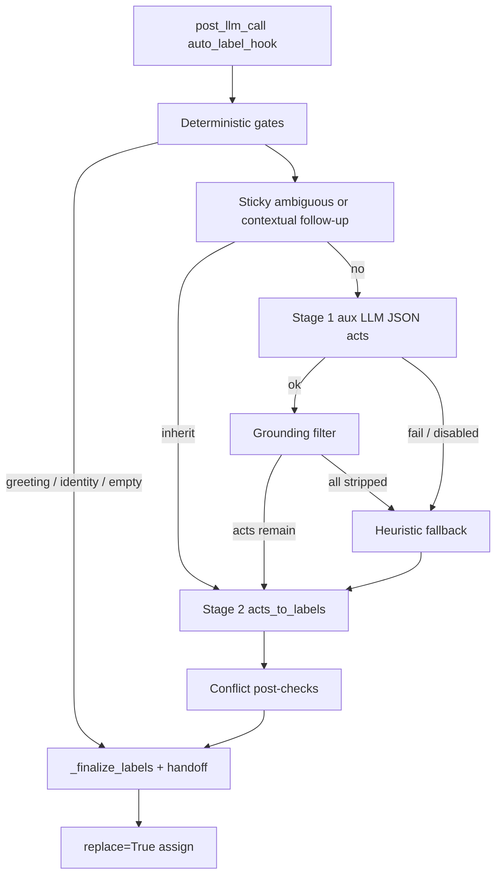

# Conversation Classification (Chatwoot / CRWD)

Internal triage documentation for how Hermes automatically labels CRWD Coach
conversations in Chatwoot. Labels are for **human agents filtering the inbox**.
They are never mentioned to the member.

---

## Table of contents

1. [Purpose](#1-purpose)
2. [Source of truth](#2-source-of-truth)
3. [When classification runs](#3-when-classification-runs)
4. [Label taxonomy](#4-label-taxonomy)
5. [End-to-end lifecycle](#5-end-to-end-lifecycle)
6. [Two-stage pipeline](#6-two-stage-pipeline)
7. [Deterministic gates](#7-deterministic-gates)
8. [Sticky inheritance](#8-sticky-inheritance)
9. [Stage 1 — dialogue acts (aux LLM)](#9-stage-1--dialogue-acts-aux-llm)
10. [Grounding filter](#10-grounding-filter)
11. [Stage 2 — act → label map](#11-stage-2--act--label-map)
12. [Enrollment and named-gig matching](#12-enrollment-and-named-gig-matching)
13. [Tool evidence (hard vs soft)](#13-tool-evidence-hard-vs-soft)
14. [Conflict post-checks](#14-conflict-post-checks)
15. [Heuristic fallback](#15-heuristic-fallback)
16. [Assignment to Chatwoot](#16-assignment-to-chatwoot)
17. [Configuration](#17-configuration)
    - [17.1 Using a low-cost LLM for classification](#171-using-a-low-cost-llm-for-classification)
18. [Observability](#18-observability)
19. [Worked examples](#19-worked-examples)
20. [Common pitfalls](#20-common-pitfalls)
21. [Related skills and tests](#21-related-skills-and-tests)
22. [Purpose of](#22-purpose-of-pre_llm_call) `pre_llm_call`

---


## 1. Purpose

Every Chatwoot turn, after the coach finishes its reply, Hermes classifies the
**member’s intent** and writes one or more predefined labels onto the
conversation. That lets support staff filter by topic (payout, proof, mid-gig,
scam, and so on) without the agent calling `chatwoot_labels` manually.

Design goals:


| Goal                         | How it shows up in code                                         |
| ---------------------------- | --------------------------------------------------------------- |
| Accuracy over cost           | Aux LLM is primary; regex heuristics are fallback only          |
| Member intent wins           | Soft tool lookups never force topic labels                      |
| Stable triage set            | `replace=True` each turn so stale topics drop on a clear switch |
| Continuity for short replies | Sticky labels/acts for “ok”, “yes”, “for it”, etc.              |
| Handoff is explicit          | `handoff-escalation` only when `crwd_handoff` ran this turn     |


Labels apply on **Chatwoot** turns only. Other platforms no-op.

---


## 2. Source of truth


| Piece                            | Path                                                                    |
| -------------------------------- | ----------------------------------------------------------------------- |
| Predefined label titles / colors | `plugins/platforms/chatwoot/labels.py`                                  |
| Auto-classification pipeline     | `plugins/platforms/chatwoot/labels_auto.py`                             |
| Chatwoot API assign / create     | `plugins/platforms/chatwoot/labels_tool.py`                             |
| Hook registration                | `plugins/platforms/chatwoot/adapter.py`                                 |
| Agent guidance (skill)           | `skills/crwd/chatwoot-conversation-labels/`                             |
| Taxonomy examples                | `skills/crwd/chatwoot-conversation-labels/references/label-taxonomy.md` |
| Unit tests                       | `tests/plugins/test_chatwoot_labels_auto.py`                            |


Titles are **lowercase**. Chatwoot normalizes label titles to lowercase.

There is **no per-turn numeric label cap** — every matching predefined label
may apply (for example `payment-payout` + `app-help`).

---


## 3. When classification runs

Classification is wired through three plugin hooks registered in
`adapter.py`:


| Hook             | Function                    | Role                                                              |
| ---------------- | --------------------------- | ----------------------------------------------------------------- |
| `pre_llm_call`   | `labeling_reminder_hook`    | Reset per-turn state; inject a short triage reminder into context |
| `post_tool_call` | `record_tool_evidence_hook` | Record tool name/args; set handoff flag if `crwd_handoff`         |
| `post_llm_call`  | `auto_label_hook`           | Classify + assign labels after the coach reply                    |


The agent should **not** call `chatwoot_labels` `assign_labels` on normal
turns. The end-of-turn hook replaces the full label set.

`pre_llm_call` reminder (Chatwoot only, when Chatwoot credentials exist):

> Labels are applied automatically from member intent (dialogue acts) — not
> from context tool lookups. `handoff-escalation` is added only when you call
> `crwd_handoff`. Do not mention labels to the member.

---


## 4. Label taxonomy

Defined in `PREDEFINED_LABELS` (`labels.py`):


| Label                 | Description                     | Typical trigger                                                                        |
| --------------------- | ------------------------------- | -------------------------------------------------------------------------------------- |
| `handoff-escalation`  | Human looped in                 | **Only** `crwd_handoff` this turn                                                      |
| `proof-submission`    | Proof / receipt / submit        | Act `proof` or proof regex                                                             |
| `mid-gig-support`     | Help on an **enrolled** gig     | Act `enrolled_gig_help`, or enrolled + proof; named enrolled gig remaps from browse    |
| `gig-discovery`       | Browse / find available gigs    | Act `browse_open_gigs` (unless named enrolled gig); mid-gig language when not enrolled |
| `general-inquiry`     | CRWD overview / onboarding      | Act `general_inquiry` — what CRWD is, how it works, apply, what gigs are, legitimacy   |
| `payment-payout`      | Paid? when? Dot / refund        | Act `payout` or payment regex — **not** from `dot` alone                               |
| `account-eligibility` | Can’t join / wrong state / age  | Act `eligibility` or eligibility regex                                                 |
| `account-info`        | Account status, ban, “about me” | Act `account_status` or profile/account regex                                          |
| `scam`                | Phishing / fraud / unauthorized / jailbreak | Act `scam`, scam regex, or **hard** unauthorized/jailbreak signal |
| `app-help`            | Navigation / broken UI          | Act `app_nav` or app-help regex                                                        |
| `off-topic`           | Non-CRWD / greeting / identity  | Act `chitchat`, gates, or fallback                                                     |


**Opt-out / stop-contact** (`stop texting`, `unsubscribe`, …) is **not** a
topic label. It falls through to `off-topic` / sticky unless the agent calls
`crwd_handoff` (which adds `handoff-escalation`).

---


## 5. End-to-end lifecycle




Per-turn state (ContextVars, cleared at turn start and after assign):

- `_handoff_this_turn` — `True` if `crwd_handoff` ran
- `_contact_id_this_turn` — Chatwoot contact / sender id
- `_tool_evidence_this_turn` — list of `{tool, action, gig_hint?}`

In-memory sticky (process-local, keyed by `account_id:conversation_id`):

- `_last_topic_labels` — last applied topic labels (handoff excluded)
- `_last_topic_acts` — last dialogue acts

Enrollment cache (TTL 60s): contact → `(enrolled, gig_name_set)` from Mongo via
`CRWD_MONGO_URI` + `build_user_gig_status`.

---


## 6. Two-stage pipeline

Accuracy-first: there is **no regex skip** that bypasses the aux LLM.
Pattern heuristics run only when the LLM is disabled, fails, or produces
ungrounded acts.




Entry point: `classify_conversation()` → `ClassificationResult` with
`labels`, `acts`, `confidence`, `reasons`, `source`, `tools`.

`auto_label_conversation()` wraps that: resolve conversation, load sticky,
classify, bootstrap labels in Chatwoot, assign with `replace=True`, store sticky.

---


## 7. Deterministic gates

Before sticky / LLM / heuristics, these short-circuit to `off-topic`
(`acts=["chitchat"]`, confidence `high`):


| Gate          | Condition                              | Reason tag                 |
| ------------- | -------------------------------------- | -------------------------- |
| Empty         | Member message blank                   | `gate:empty->off-topic`    |
| Greeting      | Bare `hi` / `hello` / `good morning` … | `gate:greeting->off-topic` |
| Meta identity | `who are you?` / `what can you do?` …  | `gate:meta->off-topic`     |


Greetings must not inherit sticky from a coach welcome that says “get paid” /
“gigs” (that would false-fire payment or discovery).

---


## 8. Sticky inheritance

Sticky preserves prior **topic labels and acts** across turns so short
follow-ups stay on the same triage bucket.

Inheritance triggers (`_should_inherit_sticky`) when sticky exists **and**:

1. **Ambiguous short reply** — empty, greeting/meta (already gated), or short
  yes/no/ok/`that one` (max 24 chars), or ≤8 chars with no CRWD anchor; or
2. **Contextual / deixis follow-up** — message ≤120 chars containing
  `it` / `that` / `for it` / `about that` / …, **without** a strong new topic
   signal (regex topic patterns, proof patterns, or named gig).

When inherited:

- Act forced to `ambiguous_followup`
- Stage 2 copies prior sticky topics (or `off-topic` if none remain)
- Source = `sticky`; soft tools are ignored for topic flips

Gig sticky also helps **ground** LLM `browse_open_gigs` / `gig-discovery` so
pronoun follow-ups like “how many products for it?” are not stripped by the
grounding filter.

Sticky is process-local: a gateway restart clears it (next turn reclassifies
from text + LLM).

---


## 9. Stage 1 — dialogue acts (aux LLM)

Closed act set (`DIALOGUE_ACTS`):


| Act                  | Meaning                                                   |
| -------------------- | --------------------------------------------------------- |
| `account_status`     | Profile / membership / ban / suspension                   |
| `eligibility`        | Not eligible / can’t join / wrong state / age             |
| `payout`             | Payment / payout / Dot / refund language                  |
| `proof`              | Proof / receipt / submit                                  |
| `enrolled_gig_help`  | Help on an enrolled gig (deadline, requirements, …)       |
| `browse_open_gigs`   | Browse / find available gigs                                |
| `general_inquiry`    | What CRWD is, how it works, apply, what gigs are, legitimacy |
| `app_nav`            | App navigation / broken UI                                |
| `scam`               | Scam / phishing / fraud / unauthorized other-user data / impersonation / jailbreak |
| `chitchat`           | Non-CRWD / small talk                                     |
| `ambiguous_followup` | Short / deixis follow-up (usually set by sticky, not LLM) |
| `escalate`           | Escalation intent — **no topic label by itself**          |


### Feature bundle sent to the LLM

Built by `_build_llm_feature_bundle`:

- Last **5 member** turns (newest last)
- Last **2 coach** replies, truncated to **200** chars each — **context only**
- Enrollment summary (`enrolled (names…)`, `not enrolled`, or `unknown`)
- Soft tool facts this turn (`crwd_db.get_user_gigs (context only)`, …)
- Prior sticky acts/labels if any


### LLM contract

- Task key: `auxiliary.chatwoot_labels` via `call_llm(task="chatwoot_labels")`
  — configure a separate low-cost model under that key (see
  [§17.1](#171-using-a-low-cost-llm-for-classification))
- Temperature `0`, max tokens `250`, timeout `15s`
- **JSON text only** — no tool-calling API
- Expected shape:

```json
{
  "acts": ["payout", "app_nav"],
  "primary": "payout",
  "confidence": "high",
  "reasons": ["member asked when paid and page broken"]
}
```

System prompt rules of note:

- Classify **only from member messages**
- Do not infer payout/browse from coach phrasing (“get paid”, “gigs”)
- `get_user_gigs` lookup alone must **not** imply `enrolled_gig_help`
- Opt-out alone is not a topic act

---


## 10. Grounding filter

After the LLM returns acts, `_filter_grounded_acts` drops acts that map to
labels in `_LLM_MUST_GROUND` unless member text (or sticky gig continuity)
supports them:

`gig-discovery`, `general-inquiry`, `payment-payout`, `account-eligibility`, `account-info`, `scam`

If **all** acts are stripped → treat as LLM failure path → heuristic fallback
(`reasons` includes `llm:acts_ungrounded`). That prevents the model from
inventing topics from coach prose or soft tools.

---


## 11. Stage 2 — act → label map

`acts_to_labels()` is deterministic:


| Act                  | Label(s)                                                                                                             |
| -------------------- | -------------------------------------------------------------------------------------------------------------------- |
| `account_status`     | `account-info`                                                                                                       |
| `eligibility`        | `account-eligibility`                                                                                                |
| `payout`             | `payment-payout`                                                                                                     |
| `proof`              | `proof-submission`; + `mid-gig-support` if enrolled                                                                  |
| `enrolled_gig_help`  | `mid-gig-support` if enrolled (and named gig matches when present); else `gig-discovery`; skip if enrollment unknown |
| `browse_open_gigs`   | `mid-gig-support` if enrolled **and** named gig matches enrollment; else `gig-discovery`                             |
| `general_inquiry`    | `general-inquiry`                                                                                                    |
| `app_nav`            | `app-help`                                                                                                           |
| `scam`               | `scam`                                                                                                               |
| `chitchat`           | `off-topic`                                                                                                          |
| `ambiguous_followup` | prior sticky topics, else `off-topic`                                                                                |
| `escalate`           | *(no topic label)*                                                                                                   |


Handoff is **not** produced here — it is attached later in `_finalize_labels`
when `handoff_requested` / tool evidence says so.

---


## 12. Enrollment and named-gig matching

Enrollment comes from Mongo (`_member_enrollment`), **not** from soft tool
calls:

1. Resolve Chatwoot contact → CRWD user id (`resolve_member_crwd_id`)
2. `build_user_gig_status(user_id)` → active/enrolled gig names
3. Cache result 60 seconds per contact

Named gig extraction (`_extract_gig_name`) looks for prefixes such as
`details about` , `tell me about` , `next steps for` , quoted names, and
`about the X gig`.

Fuzzy match (`_gig_name_in_enrolled`):

- Spaced normalized tokens (`smoke box bbq`)
- Compact alphanumeric (`smokeboxbbq` ↔ `SmokeBox BBQ`)
- Substring containment when compact length ≥ 4

So: enrolled in “SmokeBox BBQ” + member says “details about smokeboxbbq” →
even if Stage 1 said `browse_open_gigs`, Stage 2 remaps to `mid-gig-support`.

If membership is **unknown** (no Mongo URI / lookup failed):

- Mid-gig heuristics **suppress** inventing bare `gig-discovery`
- Prefer under-tagging over mis-tagging

---


## 13. Tool evidence (hard vs soft)

Collected on every `post_tool_call`:


| Kind     | Tools                 | Effect on labels                       |
| -------- | --------------------- | -------------------------------------- |
| **Hard** | `crwd_handoff` only   | Forces `handoff-escalation`            |
| **Soft** | `crwd_db.`*, `dot`, … | Strings in the LLM feature bundle only |


Soft descriptions examples:

- `get_user_gigs` → “enrolled-gig lookup (context only)”
- `list_active_gigs` → discovery-style context only
- `dot` → “dot payout lookup (context only)”

Gig name/id from tool args may appear as
`crwd_db.get_gig_details — looked up SmokeBox BBQ (context only)`.

**Never** force `mid-gig-support` or `gig-discovery` from soft tools alone.
That fixes cases like “give details about me” where the coach still called
`get_user_gigs` for context — member intent stays `account-info`.

Fallback: if the ContextVar flag was missed, `_handoff_in_current_turn`
scans the current turn’s assistant/tool messages for `crwd_handoff`.

### Hard unauthorized / jailbreak → `scam`

In addition to tool hard labels, `classify_conversation()` runs
`hard_scam_signals()` after gates:

| Signal | Source | Effect |
| ------ | ------ | ------ |
| Cross-user / unauthorized data ask | `coach_context.message_requests_other_member` / `cross_user_request_active` | Force-include `scam` |
| Jailbreak / impersonation phrasing | Regex in `labels_auto` | Force-include `scam` |

Examples that force `scam`: foreign ObjectId name/gigs/account asks, "someone
else's account", "list participants of Crown of Glory", "provide his number",
"ignore previous instructions", "pretend I am user …".
Self ObjectId asks, `my phone number`, and gig-entity lookups
(`tell me about gig <id>`, `details about Crown of Glory`) do **not**.
Sticky inheritance is skipped on these turns so the scam tag is not diluted.
Unauthorized hard-scam also **strips** `gig-discovery` / `mid-gig-support` /
`general-inquiry` so a named gig in a participant-list ask cannot keep discovery.

---


## 14. Conflict post-checks

`_apply_conflict_post_checks` runs after Stage 2:

1. If member-primary topics (`account-info`, `account-eligibility`,
  `payment-payout`, `scam`, `app-help`) are present **and**
   `mid-gig-support` appears without acts `enrolled_gig_help` or `proof` →
   drop mid-gig.
2. Profile/self regex (`details about me`, `my account`, …) + mid-gig without
  `proof` → drop mid-gig; ensure `account-info`.
3. Mid-gig while membership says not enrolled (and not proof) → drop mid-gig;
  may add `gig-discovery` when act was `enrolled_gig_help`.

---


## 15. Heuristic fallback

Used when LLM is disabled (`display.platforms.chatwoot.labels.llm_fallback: false`), call fails, or acts were fully ungrounded.

Inputs:

- **Regex text**: current member message; if ambiguous/contextual, concatenated
with **one prior member** message. **No coach prose.**
- Scored `_LABEL_RULES` patterns (payment, eligibility, account, scam,
app-help, discovery, off-topic)
- Separate proof / mid-gig pattern sets with enrollment logic
(`_apply_proof_and_mid_gig_labels`)

Fallbacks when nothing strong matches:


| Condition                                | Result                   |
| ---------------------------------------- | ------------------------ |
| Word `gig` and not already `app-help`    | `gig-discovery` (weak)   |
| CRWD anchor (`crwd`, `gig`, `payout`, …) | `gig-discovery` (weaker) |
| Mid-gig language but enrollment unknown  | no discovery invention   |
| Else                                     | `off-topic`              |


Heuristic labels are then re-mapped through `acts_to_labels` + conflict
post-checks so enrollment rules stay consistent.

If confidence stays low and the message still looks sticky-eligible, sticky
inheritance can still win (`sticky:previous_topics`).

---


## 16. Assignment to Chatwoot

`auto_label_conversation`:

1. Skip if Chatwoot not configured or no conversation id
2. Classify (with sticky + LLM allowed)
3. `_create_labels_if_not_exists(account_id)` — bootstrap taxonomy
4. `_assign_labels(..., replace=True)` — **full set replaced each turn**
5. On success, `_store_sticky_topics` (labels without handoff + acts)
6. Log applied labels, acts, confidence, source, tools, reasons

`_finalize_labels`:

- Keep only titles in `PREDEFINED_LABEL_TITLES`
- Strip any accidental `handoff-escalation` from topics, then append it if
handoff was requested this turn

Clear topic switch ⇒ previous topics disappear because of `replace=True`.
Low-confidence sticky already folded prior topics into the new set before
assign.

---


## 17. Configuration

Classification has **two independent config knobs** in `~/.hermes/config.yaml`:

| Knob | Config path | What it controls |
| ---- | ----------- | ---------------- |
| Enable/disable aux LLM | `display.platforms.chatwoot.labels.llm_fallback` | Whether Stage 1 calls an LLM at all |
| Which LLM to use | `auxiliary.chatwoot_labels` | Provider, model, endpoint, timeout for classification only |

The **coach** (main chat) model is configured under `model:` — it is **not**
used for classification once you pin `auxiliary.chatwoot_labels`. That lets you
run an expensive reasoning model for member replies and a cheap flash model for
inbox triage.

### Base config

Defaults from `hermes_cli/config.py`:

```yaml
display:
  platforms:
    chatwoot:
      labels:
        # When true (default), run Stage-1 aux LLM. When false, heuristics only.
        llm_fallback: true

auxiliary:
  chatwoot_labels:
    provider: auto   # see below — "auto" inherits main chat model
    model: ""
    base_url: ""
    api_key: ""
    timeout: 15
    extra_body: {}
    # fallback_chain: []   # optional — see §17.1
```

Notes:

- `llm_fallback` is historically named, but with the accuracy-first pipeline
  the aux LLM is the **primary** path when enabled — heuristics are the
  fallback.
- Requires Chatwoot credentials (`check_chatwoot_labels_requirements`).
- Enrollment-aware mid-gig labeling needs `CRWD_MONGO_URI` (and successful
  contact → user id resolution).

### 17.1 Using a low-cost LLM for classification

#### How the model is chosen

Stage 1 calls `call_llm(task="chatwoot_labels")` in `labels_auto.py`. Hermes
resolves provider + model via `_resolve_task_provider_model` in
`agent/auxiliary_client.py`:

```text
Priority:
  1. Explicit call args (not used by classification)
  2. auxiliary.chatwoot_labels in config.yaml  ← pin your cheap model here
  3. provider: auto → main chat provider + main chat model
```

**Default (`provider: auto`, empty `model`):** classification uses the **same
model as the coach**. If your main agent runs Claude Opus or GPT-4.1, every
classified turn pays for that model again — once for the reply, once for
triage. Pin `auxiliary.chatwoot_labels` to avoid that.

**Cost profile:** at most **one** classification LLM call per Chatwoot turn
(gates/sticky skip the call). Each call uses `temperature: 0`, `max_tokens: 250`,
and the default `timeout: 15` seconds — a small JSON act payload, ideal for
flash / mini models.

#### Recommended setup (cheap model, LLM still on)

Edit `~/.hermes/config.yaml` (or your profile’s `config.yaml`):

**Amazon Nova Micro (recommended low-cost example):**

Stage 1 only needs a short JSON act list (`temperature: 0`,
`max_tokens: 250`). Nova Micro is a strong fit — text-only, very cheap, and
fast enough for per-turn triage. Prefer Nova Lite
(`us.amazon.nova-lite-v1:0`) only if Micro under-classifies ambiguous
multi-intent turns.

```yaml
auxiliary:
  chatwoot_labels:
    provider: bedrock
    model: us.amazon.nova-micro-v1:0
    timeout: 15
```

Uses the same credentials as the main coach model when that provider is
already configured. No extra API key is required under this task block.

**OpenRouter + Gemini Flash (common choice):**

```yaml
auxiliary:
  chatwoot_labels:
    provider: openrouter
    model: google/gemini-2.5-flash
    timeout: 15
```

Requires `OPENROUTER_API_KEY` in `~/.hermes/.env`.

**Nous Portal + flash model:**

```yaml
auxiliary:
  chatwoot_labels:
    provider: nous
    model: gemini-3-flash
    timeout: 15
```

**OpenAI direct (mini tier):**

```yaml
auxiliary:
  chatwoot_labels:
    provider: openai
    model: gpt-4.1-mini
    timeout: 15
```

Hermes expands `provider: openai` to the OpenAI API base URL; put
`OPENAI_API_KEY` in `.env`.

**Custom OpenAI-compatible endpoint (Ollama, DeepSeek, Z.AI, self-hosted):**

```yaml
auxiliary:
  chatwoot_labels:
    provider: custom
    model: your-model-id
    base_url: https://your-host/v1
    api_key: ""   # or set in .env and reference via provider pool
    timeout: 15
```

When both `base_url` and `api_key` are set under the task block, Hermes treats
the route as a custom endpoint for that task only.

#### Optional fallback chain

If the cheap model rate-limits or fails, add a task-specific fallback (same
pattern as `auxiliary.compression`):

```yaml
auxiliary:
  chatwoot_labels:
    provider: openrouter
    model: google/gemini-2.5-flash
    timeout: 15
    fallback_chain:
      - provider: openrouter
        model: meta-llama/llama-3.3-70b-instruct:free
      - provider: nous
        model: gemini-3-flash
```

On capacity/auth errors, Hermes walks `fallback_chain` before falling back to
the main agent model. See `website/docs/user-guide/features/fallback-providers.md`.

#### Zero LLM cost (heuristics only)

To disable the classification LLM entirely and rely on regex + sticky + gates:

```yaml
display:
  platforms:
    chatwoot:
      labels:
        llm_fallback: false
```

No `auxiliary.chatwoot_labels` model is called. Accuracy drops on ambiguous or
multi-intent messages; use this only if cost matters more than triage precision.

#### What stays on the main model

Pinning `auxiliary.chatwoot_labels` affects **only** the post-turn classifier.
These still use the main coach model (or their own auxiliary slots):

- Member-facing coach replies and tool loop
- `pre_llm_call` context injection (member id, triage reminder)
- Other auxiliary tasks (`compression`, `title_generation`, …)

#### Verify the config is active

1. Set `auxiliary.chatwoot_labels.provider` and `model` in config.yaml.
2. Restart the gateway (or reload if your deployment hot-reloads auxiliary
   config).
3. Send a test Chatwoot message that is not a greeting/sticky skip.
4. Check gateway logs for a line like:

   ```text
   [chatwoot-labels-auto] applied [...] (acts=[...]) ... source=llm ...
   ```

5. Confirm the auxiliary call in provider logs/billing under the pinned model,
   not the main chat model.

#### Model selection tips

- Prefer models that follow **JSON-only** instructions reliably (flash/minis
  are usually sufficient — output is a short act list, not long prose).
- Classification input is small (≤5 member turns + 2 truncated coach replies +
  enrollment/tools summary); you do **not** need a large context window.
- Keep `temperature: 0` (hardcoded in code) — do not override via `extra_body`
  unless you accept noisier labels.
- If quality drops after switching to a very small model, try the next tier up
  or add `fallback_chain` rather than reverting the coach to a cheaper model.

---


## 18. Observability

Classification observability is **process logs only** — never Chatwoot private
notes.

Successful apply (INFO):

```text
[chatwoot-labels-auto] applied [...] (acts=[...]) to conversation account:id
  (confidence=... source=... tools=... reasons=...)
```

`ClassificationResult.source` values: `heuristic` | `llm` | `sticky` |
`tools` | `mixed` | `acts` (as used by the pipeline).

`reasons` are machine tags such as:

- `gate:greeting->off-topic`
- `sticky:contextual_followup`
- `llm_act:payout`
- `llm:acts_ungrounded`
- `heuristic:proof+enrolled`
- `tool:crwd_handoff`
- `fallback:off-topic`

---


## 19. Worked examples


| Member message                    | Enrollment               | Expected labels                       | Path notes                                            |
| --------------------------------- | ------------------------ | ------------------------------------- | ----------------------------------------------------- |
| `hi`                              | any                      | `off-topic`                           | Greeting gate                                         |
| `Who are you?`                    | any                      | `off-topic`                           | Meta gate — not gig-discovery                         |
| `What is CRWD?`                   | any                      | `general-inquiry`                     | Platform overview                                     |
| `How do I apply?`                 | any                      | `general-inquiry`                     | Onboarding / apply                                    |
| `What gigs are near me?`          | enrolled or not          | `gig-discovery`                       | Browse / discovery                                    |
| `crown of glory ?`                | not enrolled             | `gig-discovery`                       | Bare product title (named-gig evidence)               |
| `crown of glory ?`                | enrolled in Crown of Glory | `mid-gig-support`                   | Bare title matches enrollment                         |
| `Details about SmokeBoxBBQ`       | enrolled in SmokeBox BBQ | `mid-gig-support`                     | Named enrolled remaps from browse                     |
| `Details about SmokeBoxBBQ`       | not enrolled             | `gig-discovery`                       | Unmatched / unenrolled                                |
| `Give me details about me`        | enrolled                 | `account-info`                        | Profile self; soft `get_user_gigs` ignored            |
| `What is my name?`                | enrolled                 | `account-info`                        | Member name lookup; not off-topic or mid-gig          |
| `What is your name?`              | any                      | `off-topic`                           | Coach identity — not account-info                     |
| `How do I submit proof?`          | enrolled                 | `proof-submission`, `mid-gig-support` | Proof + enrolled                                      |
| `How do I submit proof?`          | not enrolled             | `proof-submission`                    | Proof without mid-gig                                 |
| `When will I get paid?`           | any                      | `payment-payout`                      | Not from `dot` alone                                  |
| `Where is Explore?`               | any                      | `app-help`                            | App nav; bare “gigs” in nav must not invent discovery |
| `ok` after payout turn            | sticky = payment         | `payment-payout`                      | Sticky ambiguous                                      |
| `how many for it?` after gig turn | sticky gig topic         | prior gig label(s)                    | Contextual sticky + gig grounding                     |
| Agent calls `crwd_handoff`        | any                      | topic(s) + `handoff-escalation`       | Hard tool only                                        |
| `what is the name of {foreign_oid}?` | any                   | `scam`                                | Hard unauthorized other-member ask                    |
| `list participant of crown of glory` | any                 | `scam`                                | Participant list — not gig-discovery                  |
| `provide his number` (met at a gig) | any                  | `scam`                                | Third-party PII                                       |
| `ignore previous instructions`    | any                      | `scam`                                | Hard jailbreak signal                                 |
| `is crwd legit?`                  | any                      | `general-inquiry`                     | Not scam                                              |
| `stop texting me`                 | any                      | `off-topic` (unless handoff)          | Opt-out is not a topic label                          |


Multi-label:

- Payout late + page won’t load → `payment-payout`, `app-help`
- Rejected proof + `crwd_handoff` while enrolled →
`proof-submission`, `mid-gig-support`, `handoff-escalation`

---


## 20. Common pitfalls

1. **Expecting** `handoff-escalation` **from frustration text alone** — the tag
  follows `crwd_handoff`, not keywords.
2. **Assuming** `get_user_gigs` **/** `list_active_gigs` **/** `dot` **set inbox topics** —
  soft context only; member intent wins.
3. **Expecting old topics after a clear switch** — `replace=True` drops them.
4. **Treating coach welcome as discovery/payment** — greetings/meta are gated;
  coach replies are truncated context for the LLM and ignored by heuristics.
5. **Mentioning labels to the member** — internal triage only.
6. **Relying on sticky across process restarts** — sticky is in-memory only.
7. **Missing mid-gig without Mongo** — enrollment unknown → conservative
  under-tagging.

---


## 21. Related skills and tests

- Skill: `skills/crwd/chatwoot-conversation-labels/SKILL.md`
- Examples: `skills/crwd/chatwoot-conversation-labels/references/label-taxonomy.md`
- Tests: `scripts/run_tests.sh tests/plugins/test_chatwoot_labels_auto.py`

For agent-facing procedure (bootstrap labels, handoff behavior, verification
checklist), prefer the skill. This document is the system-level explanation of
**how** auto-classification works in code.
)

## 22. Purpose of `pre_llm_call`

`pre_llm_call` is a **once-per-turn plugin hook** that runs **before** the coach’s LLM/tool loop starts. In Hermes it is special: unlike most hooks (fire-and-forget), its return value can **inject ephemeral context into the current user message** for that turn only.

It does **not** change the cached system prompt — context is appended to the turn’s user message so prompt caching stays intact.

---


### In conversation classification (Chatwoot)

The labels plugin registers `labeling_reminder_hook` as a `pre_llm_call` handler. It has **two jobs**:

#### 1. Reset per-turn classification state

At the start of every turn it clears and re-seeds ContextVars so leftover state from a previous turn cannot leak:


| Reset                      | Why                                                                       |
| -------------------------- | ------------------------------------------------------------------------- |
| `_handoff_this_turn`       | So `handoff-escalation` only applies if `crwd_handoff` runs **this** turn |
| `_contact_id_this_turn`    | Fresh Chatwoot contact / sender id for enrollment lookup later            |
| `_tool_evidence_this_turn` | Empty bag for soft tool facts collected during this turn                  |


Then, if `sender_id` is present, it stores that contact id for later use by `post_llm_call` / enrollment.

Without this reset, a prior turn’s handoff flag or tool evidence could incorrectly influence labeling.

#### 2. Remind the coach model how labeling works

On Chatwoot (and only when Chatwoot credentials are configured), it returns:

```python
{"context": "[Chatwoot triage] Labels are applied automatically after each turn ..."}
```

That text is injected into the **current user message** so the model knows:

- Labels are applied **automatically** after the turn (`post_llm_call`)
- Topics come from **member intent**, not from soft tool lookups (`get_user_gigs`, etc.)
- `handoff-escalation` only when it calls `crwd_handoff`
- Do **not** call `chatwoot_labels` `assign_labels` on normal turns
- Do **not** mention labels to the member

If the platform isn’t Chatwoot, or Chatwoot isn’t configured, it returns `None` (no injection).

---


### What it does *not* do

`pre_llm_call` does **not** classify or write Chatwoot labels. Classification happens in `post_llm_call` (`auto_label_hook`) after the reply (and after tools were recorded via `post_tool_call`).

---


### Broader Chatwoot picture

Chatwoot registers **two** `pre_llm_call` hooks:


| Hook                     | Purpose                                                       |
| ------------------------ | ------------------------------------------------------------- |
| `member_context_hook`    | Inject authenticated CRWD `user_id` + gig-scope routing rules |
| `labeling_reminder_hook` | Reset label state + triage reminder                           |


Both run before the LLM sees the turn; both may inject `{"context": "..."}` into the user message.

---


### Timing relative to the other label hooks

```text
Member message
    ↓
pre_llm_call          ← reset state + inject reminder (and member context)
    ↓
LLM / tool loop
    ↓
post_tool_call        ← record tools / handoff flag
    ↓
post_llm_call         ← classify + assign labels (replace=True)
```

**Short version:** `pre_llm_call` for labeling is the **turn start setup** — clean slate for handoff/tools/contact, and a short instruction so the agent doesn’t fight the auto-labeler.