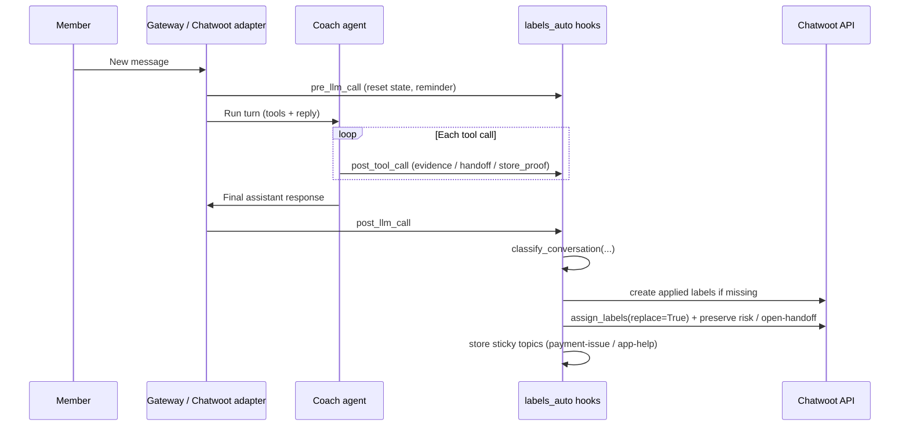
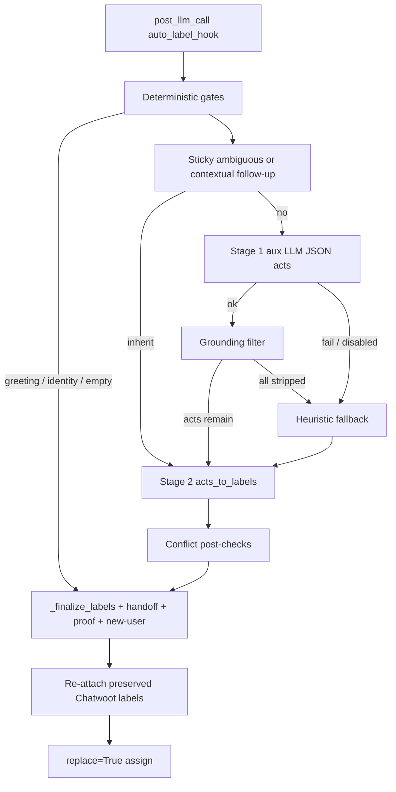

# Conversation Classification (Chatwoot / CRWD)

Internal triage documentation for how Hermes automatically labels CRWD Coach
conversations in Chatwoot. Labels are for **human agents filtering the inbox**.
They are never mentioned to the member.

Code splits the taxonomy in `plugins/platforms/chatwoot/labels.py`:

- **`APPLIED_LABELS`** — assigned by auto-labeling / skills; bootstrapped into Chatwoot
- **`UNAPPLIED_LABELS`** — kept for future reactivation; never assigned; never created on Chatwoot

Agent-facing quick reference: `skills/crwd/chatwoot-conversation-labels/`.

---

## Table of contents

1. [Purpose](#1-purpose)
2. [Source of truth](#2-source-of-truth)
3. [When classification runs](#3-when-classification-runs)
4. [Label taxonomy](#4-label-taxonomy)
5. [End-to-end lifecycle](#5-end-to-end-lifecycle)
6. [Two-stage pipeline](#6-two-stage-pipeline)
7. [Deterministic gates](#7-deterministic-gates)
8. [Sticky inheritance](#8-sticky-inheritance)
9. [Stage 1 — dialogue acts (aux LLM)](#9-stage-1--dialogue-acts-aux-llm)
10. [Grounding filter](#10-grounding-filter)
11. [Stage 2 — act → label map](#11-stage-2--act--label-map)
12. [Data-first labels (`new-user`)](#12-data-first-labels-new-user)
13. [Tool evidence (hard vs soft)](#13-tool-evidence-hard-vs-soft)
14. [Conflict post-checks](#14-conflict-post-checks)
15. [Heuristic fallback](#15-heuristic-fallback)
16. [Assignment to Chatwoot](#16-assignment-to-chatwoot)
17. [Configuration](#17-configuration)
    - [17.1 Using a low-cost LLM for classification](#171-using-a-low-cost-llm-for-classification)
18. [Observability](#18-observability)
19. [Worked examples](#19-worked-examples)
20. [Common pitfalls](#20-common-pitfalls)
21. [Related skills and tests](#21-related-skills-and-tests)
22. [Purpose of](#22-purpose-of-pre_llm_call) `pre_llm_call`

---

## 1. Purpose

Every Chatwoot turn, after the coach finishes its reply, Hermes classifies the
**member’s intent** (and a few hard data/tool signals) and writes matching
**applied** labels onto the conversation. That lets support staff filter by
topic (payment, app help, new users, proof outcome, handoff, risk) without the
agent calling `chatwoot_labels` manually.

Design goals:

| Goal                         | How it shows up in code                                         |
| ---------------------------- | --------------------------------------------------------------- |
| Accuracy over cost           | Aux LLM is primary; regex heuristics are fallback only          |
| Member intent wins           | Soft tool lookups never force topic labels                      |
| Narrow applied set           | Only titles in `APPLIED_LABEL_TITLES` are assigned               |
| Stable triage set            | `replace=True` each turn so stale topics drop on a clear switch |
| Continuity for short replies | Sticky for `payment-issue` / `app-help` on “ok”, “yes”, etc.    |
| Handoff is explicit          | `handoff-escalation` only when `crwd_handoff` ran this turn     |
| Proof / gig outcome is tool-driven | `proof-*` / `gig-complete` from this-turn `store_proof` |
| Preserve skill-owned state   | `risk-*` survive replace; handoff only while status is `open` |

Labels apply on **Chatwoot** turns only. Other platforms no-op.

---

## 2. Source of truth

| Piece                            | Path                                                                    |
| -------------------------------- | ----------------------------------------------------------------------- |
| Applied / unapplied titles       | `plugins/platforms/chatwoot/labels.py`                                  |
| Auto-classification pipeline     | `plugins/platforms/chatwoot/labels_auto.py`                             |
| Chatwoot API assign / create     | `plugins/platforms/chatwoot/labels_tool.py`                             |
| Hook registration                | `plugins/platforms/chatwoot/adapter.py`                                 |
| Agent guidance (skill)           | `skills/crwd/chatwoot-conversation-labels/`                             |
| Taxonomy examples                | `skills/crwd/chatwoot-conversation-labels/references/label-taxonomy.md` |
| Unit tests                       | `tests/plugins/test_chatwoot_labels_auto.py`                            |

Titles are **lowercase**. Chatwoot normalizes label titles to lowercase.

There is **no per-turn numeric label cap** — every matching **applied** label
may apply (for example `payment-issue` + `app-help` + `new-user`).

---

## 3. When classification runs

Classification is wired through three plugin hooks registered in
`adapter.py`:

| Hook             | Function                    | Role                                                              |
| ---------------- | --------------------------- | ----------------------------------------------------------------- |
| `pre_llm_call`   | `labeling_reminder_hook`    | Reset per-turn state; inject a short triage reminder into context |
| `post_tool_call` | `record_tool_evidence_hook` | Record tool name/args; handoff + `store_proof` verdicts           |
| `post_llm_call`  | `auto_label_hook`           | Classify + assign labels after the coach reply                    |

The agent should **not** call `chatwoot_labels` `assign_labels` on normal
turns. The end-of-turn hook replaces the full label set (while re-attaching
preserved skill-owned labels).

`pre_llm_call` reminder (Chatwoot only, when Chatwoot credentials exist):

> Labels are applied automatically after each turn. Applied topics:
> `payment-issue`, `app-help`; plus `new-user` (no completed gig yet),
> `proof-acceptance` / `proof-rejection` / `gig-complete` from `store_proof`
> this turn, and `handoff-escalation` when you call `crwd_handoff` (cleared
> when conversation status is no longer `open`). Do not call
> `chatwoot_labels` `assign_labels` during normal turns; the end-of-turn hook
> replaces labels. Do not mention labels to the member.

---

## 4. Label taxonomy

### 4.1 Applied (assigned + bootstrapped)

Defined in `APPLIED_LABELS` (`labels.py`):

| Label                | Description                                      | When it is applied                                                                 |
| -------------------- | ------------------------------------------------ | ---------------------------------------------------------------------------------- |
| `payment-issue`      | Any payment-related question                     | Act `payout` or payment regex (member text)                                        |
| `app-help`           | App navigation / broken UI                       | Act `app_nav` or app-help regex                                                    |
| `new-user`           | Member has not completed a gig yet               | **Data-first** — DB says no completed gig (unknown → skip, do not guess)           |
| `proof-acceptance`   | All proofs stored this turn accepted             | Hard: this-turn `crwd_db.store_proof` (all statuses `accepted`)                    |
| `proof-rejection`    | At least one proof this turn not accepted        | Hard: this-turn `store_proof` with any non-`accepted` status                       |
| `handoff-escalation` | Human looped in                                  | Hard: `crwd_handoff` this turn; **preserved only while status is `open`**          |
| `gig-complete`       | Gig finished this turn                           | Hard: this-turn `store_proof` with `is_gig_completed: true` (not preserved)        |
| `risk-low` … `risk-critical` | Fraud risk band                         | Owned by `crwd-risk-analyser`; auto-labeler **preserves** (`risk-*` prefix)        |

### 4.2 Unapplied (not assigned)

Defined in `UNAPPLIED_LABELS`. Stage 1 may still emit related **dialogue acts**
for observability, but Stage 2 / heuristics / finalize **never** assign these
titles:

`mid-gig-support`, `proof-submission`, `gig-discovery`, `general-inquiry`,
`payment-payout` (superseded by `payment-issue`), `account-eligibility`,
`account-info`, `scam`, `off-topic`.

**Opt-out / stop-contact** (`stop texting`, `unsubscribe`, …) is **not** a
topic label. It yields no applied topic unless the agent calls `crwd_handoff`
(which adds `handoff-escalation`).

---

## 5. End-to-end lifecycle



Per-turn state (ContextVars, cleared at turn start and after assign):

- `_handoff_this_turn` — `True` if `crwd_handoff` ran
- `_contact_id_this_turn` — Chatwoot contact / sender id
- `_tool_evidence_this_turn` — list of `{tool, action, gig_hint?, proof_status?, …}`

In-memory sticky (process-local, keyed by `account_id:conversation_id`):

- `_last_topic_labels` — last applied sticky topics (`payment-issue`, `app-help` only)
- `_last_topic_acts` — last dialogue acts

Caches (TTL 60s per contact):

- Enrollment: contact → `(enrolled, gig_name_set)` — LLM context + legacy helpers
- Completed gig: contact → `bool | None` — drives `new-user`

---

## 6. Two-stage pipeline

Accuracy-first: there is **no regex skip** that bypasses the aux LLM.
Pattern heuristics run only when the LLM is disabled, fails, or produces
ungrounded acts.



Entry point: `classify_conversation()` → `ClassificationResult` with
`labels`, `acts`, `confidence`, `reasons`, `source`, `tools`.

`auto_label_conversation()` wraps that: resolve conversation, load sticky,
classify, bootstrap **applied** labels in Chatwoot, merge preserved labels,
assign with `replace=True`, store sticky.

---

## 7. Deterministic gates

Before sticky / LLM / heuristics, these short-circuit to **no topic labels**
(`acts=["chitchat"]`, confidence `high`). They do **not** assign `off-topic`
(unapplied).

| Gate          | Condition                              | Reason tag                |
| ------------- | -------------------------------------- | ------------------------- |
| Empty         | Member message blank                   | `gate:empty->no-topic`    |
| Greeting      | Bare `hi` / `hello` / `good morning` … | `gate:greeting->no-topic` |
| Meta identity | `who are you?` / `what can you do?` …  | `gate:meta->no-topic`     |

Greetings must not inherit sticky from a coach welcome that says “get paid” /
“gigs” (that would false-fire `payment-issue`).

`new-user` / handoff / proof verdicts can still attach in `_finalize_labels`
after a gated turn when those signals apply.

---

## 8. Sticky inheritance

Sticky preserves prior **applied intent topics** across turns so short
follow-ups stay on the same triage bucket.

Only these titles participate: **`payment-issue`**, **`app-help`**
(`_STICKY_TOPIC_LABELS`). Excluded from sticky memory: handoff, `gig-complete`,
`new-user`, proof acceptance/rejection, and `risk-*`.

Inheritance triggers (`_should_inherit_sticky`) when sticky exists **and**:

1. **Ambiguous short reply** — empty, greeting/meta (already gated), or short
   yes/no/ok/`that one` (max 24 chars), or ≤8 chars with no CRWD anchor; or
2. **Contextual / deixis follow-up** — message ≤120 chars containing
   `it` / `that` / `for it` / `about that` / …, **without** a strong new topic
   signal (payment / app-help regex, etc.).

When inherited:

- Act forced to `ambiguous_followup`
- Stage 2 copies prior sticky topics that are still in `_STICKY_TOPIC_LABELS`
- Source = `sticky`; soft tools are ignored for topic flips

Sticky is process-local: a gateway restart clears it (next turn reclassifies
from text + LLM). Preserved Chatwoot labels (`risk-*`, and
`handoff-escalation` only while status is `open`) are separate — they are
re-read from Chatwoot on assign, not from sticky memory. `gig-complete` is
turn-scoped and is not preserved.

---

## 9. Stage 1 — dialogue acts (aux LLM)

Closed act set (`DIALOGUE_ACTS`) — used for classification and logs. Only
`payout` and `app_nav` currently map to applied topic labels in Stage 2.

| Act                  | Meaning                                                   | Applied label?        |
| -------------------- | --------------------------------------------------------- | --------------------- |
| `payout`             | Payment / payout / Dot / refund language                  | → `payment-issue`     |
| `app_nav`            | App navigation / broken UI                                | → `app-help`          |
| `account_status`     | Profile / membership / ban / suspension                   | no (unapplied)        |
| `eligibility`        | Not eligible / can’t join / wrong state / age             | no                    |
| `proof`              | Proof / receipt / submit                                  | no (`proof-*` is tool)|
| `enrolled_gig_help`  | Help on an enrolled gig                                   | no                    |
| `browse_open_gigs`   | Browse / find available gigs                              | no                    |
| `general_inquiry`    | What CRWD is, how it works, apply, legitimacy             | no                    |
| `scam`               | Scam / phishing / unauthorized / jailbreak                | no (obs only)         |
| `chitchat`           | Non-CRWD / small talk                                     | no                    |
| `ambiguous_followup` | Short / deixis follow-up (usually sticky)                 | sticky topics only    |
| `escalate`           | Escalation intent                                         | no topic by itself    |

### Feature bundle sent to the LLM

Built by `_build_llm_feature_bundle`:

- Last **5 member** turns (newest last)
- Last **2 coach** replies, truncated to **200** chars each — **context only**
- Enrollment summary (`enrolled (names…)`, `not enrolled`, or `unknown`)
- Soft tool facts this turn (`crwd_db.get_user_gigs (context only)`, …)
- Prior sticky acts/labels if any

### LLM contract

- Task key: `auxiliary.chatwoot_labels` via `call_llm(task="chatwoot_labels")`
  — configure a separate low-cost model under that key (see
  [§17.1](#171-using-a-low-cost-llm-for-classification))
- Temperature `0`, max tokens `250`, timeout `15s`
- **JSON text only** — no tool-calling API
- Expected shape:

```json
{
  "acts": ["payout", "app_nav"],
  "primary": "payout",
  "confidence": "high",
  "reasons": ["member asked when paid and page broken"]
}
```

System prompt rules of note:

- Classify **only from member messages**
- Do not infer payout/browse from coach phrasing (“get paid”, “gigs”)
- `get_user_gigs` lookup alone must **not** imply `enrolled_gig_help`
- Opt-out alone is not a topic act

---

## 10. Grounding filter

After the LLM returns acts, `_filter_grounded_acts` drops acts that map to
labels in `_LLM_MUST_GROUND` unless member text supports them:

`payment-issue`, `app-help`

(Other acts may pass through for observability but Stage 2 emits no applied
label for them.)

If **all** acts are stripped → treat as LLM failure path → heuristic fallback
(`reasons` includes `llm:acts_ungrounded`). That prevents the model from
inventing payment/app topics from coach prose or soft tools.

---

## 11. Stage 2 — act → label map

`acts_to_labels()` is deterministic and emits **applied** titles only:

| Act                  | Label(s)                                      |
| -------------------- | --------------------------------------------- |
| `payout`             | `payment-issue`                               |
| `app_nav`            | `app-help`                                    |
| `ambiguous_followup` | prior sticky topics in `_STICKY_TOPIC_LABELS` |
| all other acts       | *(no applied topic)*                          |

Handoff, proof verdicts, and `new-user` are **not** produced here — they are
attached later in `_finalize_labels`.

Enrollment / named-gig remaps that used to turn browse → mid-gig are **disabled
for assignment** (`membership` is unused in Stage 2). Enrollment text still
appears in the LLM feature bundle for better act quality.

---

## 12. Data-first labels (`new-user`)

`new-user` is **not** intent classification. It is attached in
`_finalize_labels` when the member is known **not** to have completed at least
one gig (all required proofs accepted).

Lookup (`_member_has_completed_gig`):

1. Resolve Chatwoot contact → CRWD user id
2. `user_has_completed_gig(user_id)` via Mongo (`CRWD_MONGO_URI`)
3. Cache 60 seconds per contact
4. This-turn `store_proof` with `is_gig_completed=true` forces completed → drops
   `new-user` for that turn

| DB / evidence                         | Result                         |
| ------------------------------------- | ------------------------------ |
| Known incomplete (`completed is False`) | include `new-user`           |
| Known complete                        | omit `new-user`                |
| Unknown (no Mongo / lookup failed)    | omit — **do not guess**        |

Payment status does not affect `new-user`.

---

## 13. Tool evidence (hard vs soft)

Collected on every `post_tool_call`:

| Kind     | Tools / signals                         | Effect on labels                                      |
| -------- | --------------------------------------- | ----------------------------------------------------- |
| **Hard** | `crwd_handoff`                          | Forces `handoff-escalation`                           |
| **Hard** | `crwd_db` `store_proof` this turn       | `proof-acceptance` or `proof-rejection` (mutually exclusive for the turn) |
| **Soft** | `crwd_db.*` lookups, `dot`, …           | Strings in the LLM feature bundle only                |

Proof verdict rules (`proof_verdict_labels_from_tools`):

- Any non-`accepted` status among this-turn stores → `proof-rejection`
- Else all accepted (≥1) → `proof-acceptance`
- No `store_proof` this turn → neither label

Soft descriptions examples:

- `get_user_gigs` → “enrolled-gig lookup (context only)”
- `list_active_gigs` → discovery-style context only
- `dot` → “dot payout lookup (context only)”

Soft tools never force applied topics. Fallback: if the ContextVar flag was
missed, `_handoff_in_current_turn` scans the current turn’s messages for
`crwd_handoff`.

### Hard scam signals (observability only)

`hard_scam_signals()` still detects unauthorized / jailbreak phrasing and may
set act `scam` + reasons for logs. The **`scam` label is unapplied** — it is
stripped before assign and never written to Chatwoot.

---

## 14. Conflict post-checks

`_apply_conflict_post_checks` runs after Stage 2. With the narrowed applied
set it mainly filters the candidate list to `APPLIED_LABEL_TITLES` (legacy
mid-gig / discovery conflict rules no longer emit labels).

**Proof-turn intent suppress.** When this turn has hard `store_proof` evidence
(`proof-acceptance` or `proof-rejection`), `_strip_topics_when_proof_turn`
(called from `classify_conversation` → `_finish`) drops `payment-issue` and
`app-help` unless the **member text** independently grounds that topic (same
grounding rules as `_llm_label_grounded`). A receipt upload is not a payout
question; sticky inheritance alone must not keep `payment-issue` on a proof
turn. Grounded exception: member asks “when will I get paid?” **and**
`store_proof` runs → both `payment-issue` and the proof verdict may apply.

If `store_proof` was called but no `proof_status` was recorded, reasons include
`tool:store_proof:missing_status` (observability). Verbal “approved” without
`store_proof` still yields **no** `proof-*` label — that is intentional.

---

## 15. Heuristic fallback

Used when LLM is disabled (`display.platforms.chatwoot.labels.llm_fallback: false`),
call fails, or acts were fully ungrounded.

Inputs:

- **Regex text**: current member message; if ambiguous/contextual, concatenated
  with **one prior member** message. **No coach prose.**
- Scored `_LABEL_RULES` for **applied** intent only: `payment-issue`, `app-help`
- Legacy proof / mid-gig pattern helpers remain for reasons /
  enrollment-unknown suppress behavior but **do not append unapplied titles**

Fallbacks when nothing strong matches: **no topic** (`fallback:no-topic` /
`heuristic:fallback->no-topic`) — not `off-topic` or `gig-discovery`.

If confidence stays low and the message still looks sticky-eligible, sticky
inheritance can still win (`sticky:previous_topics`).

---

## 16. Assignment to Chatwoot

`auto_label_conversation`:

1. Skip if Chatwoot not configured or no conversation id
2. Classify (with sticky + LLM allowed)
3. `_create_labels_if_not_exists(account_id)` — bootstrap **applied** titles only
4. Merge `_preserved_labels` from the live conversation:
   - `handoff-escalation` only if conversation status is `open`
   - any `risk-*`
   - (`gig-complete` is **not** preserved — turn-scoped only)
5. `_assign_labels(..., replace=True)` — **full set replaced each turn**
6. On success, `_store_sticky_topics` for `payment-issue` / `app-help` only
   (preserved labels intentionally **not** folded into sticky)
7. Log applied labels, acts, confidence, source, tools, reasons

`_finalize_labels`:

- Keep only titles in `APPLIED_LABEL_TITLES`
- Drop non-sticky / risk titles from the topic bag, then append:
  - proof verdicts / `gig-complete` this turn
  - `new-user` when data-first says incomplete
  - `handoff-escalation` when handoff was requested this turn

Clear topic switch ⇒ previous intent topics disappear because of `replace=True`.
Preserved risk / open-handoff labels are re-attached after classify so they are not wiped.

---

## 17. Configuration

Classification has **two independent config knobs** in `~/.hermes/config.yaml`:

| Knob | Config path | What it controls |
| ---- | ----------- | ---------------- |
| Enable/disable aux LLM | `display.platforms.chatwoot.labels.llm_fallback` | Whether Stage 1 calls an LLM at all |
| Which LLM to use | `auxiliary.chatwoot_labels` | Provider, model, endpoint, timeout for classification only |

The **coach** (main chat) model is configured under `model:` — it is **not**
used for classification once you pin `auxiliary.chatwoot_labels`. That lets you
run an expensive reasoning model for member replies and a cheap flash model for
inbox triage.

### Base config

Defaults from `hermes_cli/config.py`:

```yaml
display:
  platforms:
    chatwoot:
      labels:
        # When true (default), run Stage-1 aux LLM. When false, heuristics only.
        llm_fallback: true

auxiliary:
  chatwoot_labels:
    provider: auto   # see below — "auto" inherits main chat model
    model: ""
    base_url: ""
    api_key: ""
    timeout: 15
    extra_body: {}
    # fallback_chain: []   # optional — see §17.1
```

Notes:

- `llm_fallback` is historically named, but with the accuracy-first pipeline
  the aux LLM is the **primary** path when enabled — heuristics are the
  fallback.
- Requires Chatwoot credentials (`check_chatwoot_labels_requirements`).
- `new-user` needs `CRWD_MONGO_URI` (and successful contact → user id
  resolution). Unknown membership → label omitted.

### 17.1 Using a low-cost LLM for classification

#### How the model is chosen

Stage 1 calls `call_llm(task="chatwoot_labels")` in `labels_auto.py`. Hermes
resolves provider + model via `_resolve_task_provider_model` in
`agent/auxiliary_client.py`:

```text
Priority:
  1. Explicit call args (not used by classification)
  2. auxiliary.chatwoot_labels in config.yaml  ← pin your cheap model here
  3. provider: auto → main chat provider + main chat model
```

**Default (`provider: auto`, empty `model`):** classification uses the **same
model as the coach**. If your main agent runs Claude Opus or GPT-4.1, every
classified turn pays for that model again — once for the reply, once for
triage. Pin `auxiliary.chatwoot_labels` to avoid that.

**Cost profile:** at most **one** classification LLM call per Chatwoot turn
(gates/sticky skip the call). Each call uses `temperature: 0`, `max_tokens: 250`,
and the default `timeout: 15` seconds — a small JSON act payload, ideal for
flash / mini models.

#### Recommended setup (cheap model, LLM still on)

Edit `~/.hermes/config.yaml` (or your profile’s `config.yaml`):

**Amazon Nova Micro (recommended low-cost example):**

Stage 1 only needs a short JSON act list (`temperature: 0`,
`max_tokens: 250`). Nova Micro is a strong fit — text-only, very cheap, and
fast enough for per-turn triage. Prefer Nova Lite
(`us.amazon.nova-lite-v1:0`) only if Micro under-classifies ambiguous
multi-intent turns.

```yaml
auxiliary:
  chatwoot_labels:
    provider: bedrock
    model: us.amazon.nova-micro-v1:0
    timeout: 15
```

Uses the same credentials as the main coach model when that provider is
already configured. No extra API key is required under this task block.

**OpenRouter + Gemini Flash (common choice):**

```yaml
auxiliary:
  chatwoot_labels:
    provider: openrouter
    model: google/gemini-2.5-flash
    timeout: 15
```

Requires `OPENROUTER_API_KEY` in `~/.hermes/.env`.

**Nous Portal + flash model:**

```yaml
auxiliary:
  chatwoot_labels:
    provider: nous
    model: gemini-3-flash
    timeout: 15
```

**OpenAI direct (mini tier):**

```yaml
auxiliary:
  chatwoot_labels:
    provider: openai
    model: gpt-4.1-mini
    timeout: 15
```

Hermes expands `provider: openai` to the OpenAI API base URL; put
`OPENAI_API_KEY` in `.env`.

**Custom OpenAI-compatible endpoint (Ollama, DeepSeek, Z.AI, self-hosted):**

```yaml
auxiliary:
  chatwoot_labels:
    provider: custom
    model: your-model-id
    base_url: https://your-host/v1
    api_key: ""   # or set in .env and reference via provider pool
    timeout: 15
```

When both `base_url` and `api_key` are set under the task block, Hermes treats
the route as a custom endpoint for that task only.

#### Optional fallback chain

If the cheap model rate-limits or fails, add a task-specific fallback (same
pattern as `auxiliary.compression`):

```yaml
auxiliary:
  chatwoot_labels:
    provider: openrouter
    model: google/gemini-2.5-flash
    timeout: 15
    fallback_chain:
      - provider: openrouter
        model: meta-llama/llama-3.3-70b-instruct:free
      - provider: nous
        model: gemini-3-flash
```

On capacity/auth errors, Hermes walks `fallback_chain` before falling back to
the main agent model. See `website/docs/user-guide/features/fallback-providers.md`.

#### Zero LLM cost (heuristics only)

To disable the classification LLM entirely and rely on regex + sticky + gates:

```yaml
display:
  platforms:
    chatwoot:
      labels:
        llm_fallback: false
```

No `auxiliary.chatwoot_labels` model is called. Accuracy drops on ambiguous or
multi-intent messages; use this only if cost matters more than triage precision.
Heuristics only emit `payment-issue` / `app-help` (plus finalize hard/data labels).

#### What stays on the main model

Pinning `auxiliary.chatwoot_labels` affects **only** the post-turn classifier.
These still use the main coach model (or their own auxiliary slots):

- Member-facing coach replies and tool loop
- `pre_llm_call` context injection (member id, triage reminder)
- Other auxiliary tasks (`compression`, `title_generation`, …)

#### Verify the config is active

1. Set `auxiliary.chatwoot_labels.provider` and `model` in config.yaml.
2. Restart the gateway (or reload if your deployment hot-reloads auxiliary
   config).
3. Send a test Chatwoot message that is not a greeting/sticky skip.
4. Check gateway logs for a line like:

   ```text
   [chatwoot-labels-auto] applied [...] (acts=[...]) ... source=llm ...
   ```

5. Confirm the auxiliary call in provider logs/billing under the pinned model,
   not the main chat model.

#### Model selection tips

- Prefer models that follow **JSON-only** instructions reliably (flash/minis
  are usually sufficient — output is a short act list, not long prose).
- Classification input is small (≤5 member turns + 2 truncated coach replies +
  enrollment/tools summary); you do **not** need a large context window.
- Keep `temperature: 0` (hardcoded in code) — do not override via `extra_body`
  unless you accept noisier labels.
- If quality drops after switching to a very small model, try the next tier up
  or add `fallback_chain` rather than reverting the coach to a cheaper model.

---

## 18. Observability

Classification observability is **process logs only** — never Chatwoot private
notes.

Successful apply (INFO):

```text
[chatwoot-labels-auto] applied [...] (acts=[...]) to conversation account:id
  (confidence=... source=... tools=... reasons=...)
```

`ClassificationResult.source` values: `heuristic` | `llm` | `sticky` |
`tools` | `mixed` | `acts` (as used by the pipeline).

`reasons` are machine tags such as:

- `gate:greeting->no-topic`
- `sticky:contextual_followup`
- `llm_act:payout`
- `llm:acts_ungrounded`
- `heuristic:payment-issue`
- `tool:crwd_handoff`
- `tool:store_proof:acceptance` / `tool:store_proof:rejection`
- `data:new-user`
- `fallback:no-topic`

Acts like `scam` / `browse_open_gigs` may appear in `acts=` for debugging even
when no matching Chatwoot label is assigned.

---

## 19. Worked examples

| Member / signal                         | Expected applied labels                         | Path notes                                      |
| --------------------------------------- | ----------------------------------------------- | ----------------------------------------------- |
| `hi`                                    | _(none)_ or `new-user` if incomplete            | Greeting gate → no topic                        |
| `Who are you?`                          | _(none)_ or `new-user`                          | Meta gate                                       |
| `What is CRWD?`                         | _(none)_ or `new-user`                          | `general-inquiry` act unapplied                 |
| `What gigs are near me?`                | _(none)_ or `new-user`                          | Discovery unapplied                             |
| `How do I submit proof?`                | _(none)_ or `new-user`                          | Proof question ≠ proof verdict labels           |
| `When will I get paid?`                 | `payment-issue` (+ `new-user` if applicable)    | Intent                                          |
| `Where is Explore?`                     | `app-help`                                      | App nav                                         |
| Payout late + page won’t load           | `payment-issue`, `app-help`                     | Multi-label                                     |
| `ok` after a payment turn               | `payment-issue`                                 | Sticky                                          |
| All `store_proof` accepted this turn    | `proof-acceptance`                              | Hard tool                                       |
| Any `store_proof` rejected this turn    | `proof-rejection`                               | Hard tool                                       |
| `store_proof` with `is_gig_completed`   | `gig-complete` (+ proof verdict)                | Hard tool; **not** preserved                    |
| Agent calls `crwd_handoff`              | topic(s) + `handoff-escalation`                 | Hard tool; preserved while status `open`        |
| Member never completed a gig (DB known) | includes `new-user`                             | Data-first                                      |
| Gig completed / unknown DB              | no `new-user`                                   | Complete or do-not-guess                        |
| `stop texting me`                       | _(none)_ unless handoff                         | Opt-out is not a topic                          |
| Jailbreak / foreign-user PII ask        | _(no `scam` label)_                             | Act/reasons only; label unapplied               |
| Skill sets `risk-*`                     | preserved across replace turns                  | `_preserved_labels`                             |

---

## 20. Common pitfalls

1. **Expecting** `handoff-escalation` **from frustration text alone** — the tag
   follows `crwd_handoff`, not keywords.
2. **Expecting unapplied titles** (`gig-discovery`, `scam`, `off-topic`, …) —
   they will not appear on conversations.
3. **Assuming** `get_user_gigs` **/** `list_active_gigs` **/** `dot` **set inbox topics** —
   soft context only; member intent wins.
4. **Expecting proof topic from wording alone** — `proof-acceptance` /
   `proof-rejection` require this-turn `store_proof`, not “how do I submit proof?”.
5. **Expecting old topics after a clear switch** — `replace=True` drops them
   (except `risk-*`, and `handoff-escalation` only while status is `open`).
6. **Treating coach welcome as payment** — greetings/meta are gated; coach
   replies are truncated context for the LLM and ignored by heuristics.
7. **Mentioning labels to the member** — internal triage only.
8. **Relying on sticky across process restarts** — sticky is in-memory only;
   preserved Chatwoot labels survive because they are re-read from the API.
9. **Guessing `new-user` without Mongo** — unknown completed-gig state skips
   the label.
10. **Expecting `gig-complete` to stick** — it is turn-scoped like proof
    verdicts; later turns drop it under `replace=True`.

---

## 21. Related skills and tests

- Skill: `skills/crwd/chatwoot-conversation-labels/SKILL.md`
- Examples: `skills/crwd/chatwoot-conversation-labels/references/label-taxonomy.md`
- Proof / risk owners: `skills/crwd/crwd-proof-validator/`, `skills/crwd/crwd-risk-analyser/`
- Tests: `scripts/run_tests.sh tests/plugins/test_chatwoot_labels_auto.py`

For agent-facing procedure (bootstrap labels, handoff behavior, verification
checklist), prefer the skill. This document is the system-level explanation of
**how** auto-classification works in code.

---

## 22. Purpose of `pre_llm_call`

`pre_llm_call` is a **once-per-turn plugin hook** that runs **before** the coach’s LLM/tool loop starts. In Hermes it is special: unlike most hooks (fire-and-forget), its return value can **inject ephemeral context into the current user message** for that turn only.

It does **not** change the cached system prompt — context is appended to the turn’s user message so prompt caching stays intact.

### In conversation classification (Chatwoot)

The labels plugin registers `labeling_reminder_hook` as a `pre_llm_call` handler. It has **two jobs**:

#### 1. Reset per-turn classification state

At the start of every turn it clears and re-seeds ContextVars so leftover state from a previous turn cannot leak:

| Reset                      | Why                                                                       |
| -------------------------- | ------------------------------------------------------------------------- |
| `_handoff_this_turn`       | So `handoff-escalation` only applies if `crwd_handoff` runs **this** turn |
| `_contact_id_this_turn`    | Fresh Chatwoot contact / sender id for completed-gig / enrollment lookup  |
| `_tool_evidence_this_turn` | Empty bag for soft tools + `store_proof` verdicts this turn               |

Then, if `sender_id` is present, it stores that contact id for later use by `post_llm_call`.

Without this reset, a prior turn’s handoff flag or tool evidence could incorrectly influence labeling.

#### 2. Remind the coach model how labeling works

On Chatwoot (and only when Chatwoot credentials are configured), it returns context naming the **applied** set (`payment-issue`, `app-help`, `new-user`, proof verdicts, handoff) so the model knows:

- Labels are applied **automatically** after the turn (`post_llm_call`)
- Do **not** call `chatwoot_labels` `assign_labels` on normal turns
- Do **not** mention labels to the member

If the platform isn’t Chatwoot, or Chatwoot isn’t configured, it returns `None` (no injection).

### What it does *not* do

`pre_llm_call` does **not** classify or write Chatwoot labels. Classification happens in `post_llm_call` (`auto_label_hook`) after the reply (and after tools were recorded via `post_tool_call`).

### Broader Chatwoot picture

Chatwoot registers **two** `pre_llm_call` hooks:

| Hook                     | Purpose                                                       |
| ------------------------ | ------------------------------------------------------------- |
| `member_context_hook`    | Inject authenticated CRWD `user_id` + gig-scope routing rules |
| `labeling_reminder_hook` | Reset label state + triage reminder                           |

Both run before the LLM sees the turn; both may inject `{"context": "..."}` into the user message.

### Timing relative to the other label hooks

```text
Member message
    ↓
pre_llm_call          ← reset state + inject reminder (and member context)
    ↓
LLM / tool loop
    ↓
post_tool_call        ← record tools / handoff / store_proof
    ↓
post_llm_call         ← classify + assign labels (replace=True + preserve)
```

**Short version:** `pre_llm_call` for labeling is the **turn start setup** — clean slate for handoff/tools/contact, and a short instruction so the agent doesn’t fight the auto-labeler.
