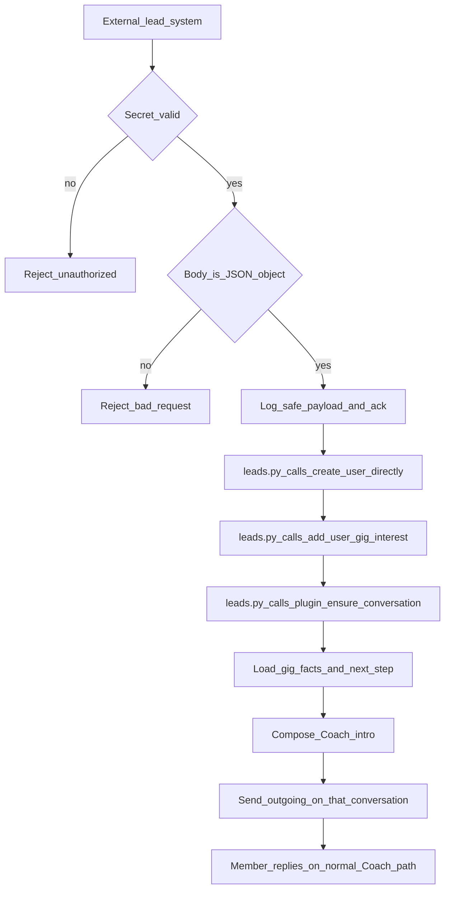
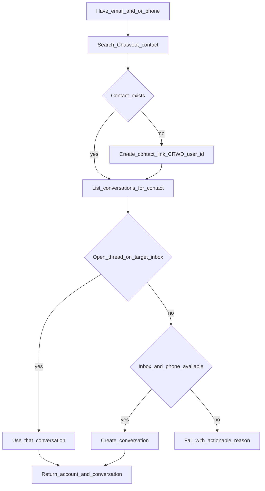

# CRWD Leads Ingress — Functional Design

Audience: agents and humans continuing this work. This document is **what the
leads HTTP endpoint is for and what it must eventually do**, not how it is
implemented. Do not treat code layout, ports, or module names as part of this
contract.

**Status today:** authenticated POST parses `{gig_id, business_owner_id, user}`,
then [`plugins/platforms/chatwoot/leads.py`](../../plugins/platforms/chatwoot/leads.py)
calls **`_create_user`**, **`_add_user_gig_interest`**, then
**`ensure_conversation`**. On 200, the Chatwoot adapter schedules a Hermes
Coach turn on that `account:conversation` (no fake inbound Chatwoot message).
The `crwd-lead-intro` skill drives a grounded outgoing reply.

- `_create_user` is **not** a `crwd_db` LLM action.
- `add_user_gig_interest` **is** on the `crwd_db` enum; leads still calls the
  helper directly after user upsert.

**Not done:** switching the target inbox from `Channel::Api` to SMS.

---

## Current Chatwoot slice: ensure conversation (API inbox)

After user + interest succeed, `leads.py` calls
[`plugins/platforms/chatwoot/conversations.py`](../../plugins/platforms/chatwoot/conversations.py)
``ensure_conversation`` (user token: `CHATWOOT_AGENT_TOKEN`).

That helper **finds or creates** the member thread:

1. Resolve the target inbox: `channel_type == Channel::Api` (constant
   `LEADS_INBOX_CHANNEL`; optional `CHATWOOT_INBOX_ID` when more than one API
   inbox). SMS inboxes are not used in this slice.
2. Search Chatwoot contact by email and/or phone.
3. Create the contact if missing; store CRWD `user_id` on contact custom
   attributes when possible (`joincrwd_user_id`).
4. List **all** conversations for that contact; reuse one on the API inbox
   (`pending` first, then other statuses including `open` / `resolved`).
5. Otherwise **create** a pending conversation on the API inbox (`source_id`
   from contact_inbox). No first message.
6. Fail with an actionable error if conversation cannot be created — do not
   silently skip.

Success JSON adds Chatwoot identity (`account_id`, `conversation_id`,
`chat_id`, `inbox_id`, `contact_id`, `conversation_created`,
`conversation_status`) and `coach_turn_started` (true when the Hermes turn
was queued).

---

## Problem

CRWD Coach only knows members that already exist in CRWD’s system of record.
Marketing and partner surfaces (for example Lovable) keep their own user
stores. A person can express interest in gigs there and still be invisible to
Coach and to Chatwoot.

The leads endpoint is the **handoff** from those systems into CRWD + Coach.

---

## Who calls it

An **external trusted client** (Lovable or another CRWD-owned surface) POSTs
when a person becomes a lead: identity (email and/or phone, name) plus one or
more gig identifiers they are interested in, plus a source label.

Callers must share a **secret** with the Chatwoot/Coach listener (same class of
credential as inbound Chatwoot events). Unauthenticated or wrong-secret
requests are rejected. The body is treated as untrusted data even when the
request is authenticated.

---

## Responsibilities (the endpoint owns this pipeline)

The ingress is responsible for the **whole lead-to-first-Coach-message
pipeline**, even if early slices only do the first step.

| # | Responsibility | Meaning |
|---|----------------|---------|
| 1 | **Authenticate and accept** | Prove the caller is allowed. Parse a JSON object. Reject oversized or invalid bodies. |
| 2 | **Acknowledge** | Return a clear success/failure so the caller can retry. Prefer idempotent handling if the same lead is posted twice. |
| 3 | **Record safely** | Log enough to debug (source, identity keys, gig ids) without secrets (tokens, passwords). |
| 4 | **Upsert the CRWD person** | Create or reuse a CRWD user from email/phone/name. **Call site is `leads.py` → `create_user` (direct import).** Do not invent passwords or overwrite unrelated profile fields blindly. |
| 5 | **Attach gig interest** | For each gig id, record that this person is **interested** in that gig, in the same membership/participation model CRWD already uses (must match what the member app reads). Idempotent if the row already exists. |
| 6 | **Ensure a Chatwoot thread** | Plugin helper called from `leads.py`: find a Chatwoot contact by email/phone; create if missing. Reuse an open conversation on the configured inbox if one exists; **create** one if not. Fail if inbox/phone cannot support create. |
| 7 | **Ground gig facts** | Load real gig details and a real next step from CRWD data (payout, dates, stage). Do not invent enrollment or payout state. |
| 8 | **First Coach message** | Compose a short, Coach-voiced introduction (not a frozen template) and send it as an **outgoing** message on **that** conversation — the same thread the person will reply into. |
| 9 | **Stay out of the member’s later turns** | After send, inbound replies continue on the normal Chatwoot Coach path. The leads call must not leave the member looking “unregistered” if a CRWD user was just created. |

What the endpoint **must not** do:

- Expose **create-user** writes on ordinary Coach SMS turns (do not add
  `create_user` to the `crwd_db` action enum). Gig **interest** is available to
  Coach as `add_user_gig_interest` (`isAccepted` false / `status` Interested).
- Send the intro to a staff home channel or a throwaway webhook session instead of the member’s conversation.
- Double-send (deterministic canned SMS **and** a Coach turn for the same lead).
- Treat “fetch conversation only” as enough — many leads have never messaged, so there is no conversation yet.

---

## Current slice (done): user upsert + gig interest + Chatwoot conversation + Coach turn

1. Caller POSTs `{gig_id, business_owner_id, user}` (email and/or phone).
2. Shared secret is checked; invalid JSON / missing identity / invalid ids → 400.
3. `leads.py` calls `_create_user` then `_add_user_gig_interest` directly,
   then `ensure_conversation` (API inbox: reuse or create).
4. Interest row: `status: Interested`, `isInterested: true`, `isAccepted: false`.
   Idempotent on the same open `crwd_id` + `member`. Unknown gig → error.
5. Success: `accepted`, `gig_id`, `business_owner_id`, `user_id`, `created`,
   `interest_created`, `membership_id`, plus Chatwoot `account_id`,
   `conversation_id`, `chat_id`, `inbox_id`, `contact_id`,
   `conversation_created`, `conversation_status`, `coach_turn_started`.
6. If `conversation_status` is not `open` and the gateway message handler is
   attached, a background Hermes turn runs on that session (`crwd-lead-intro`).
   The HTTP response does not wait for the LLM. No inbound Chatwoot message is
   created; `adapter.send()` posts the outgoing Coach reply.

---

## Request body

```json
{
  "gig_id": "24-hex",
  "business_owner_id": "24-hex",
  "user": {
    "email": "optional",
    "phone": "optional",
    "full_name": "optional",
    "first_name": "optional",
    "last_name": "optional",
    "name": "optional alias of full_name"
  }
}
```

---

## Target task flow



### Subflow: ensure Chatwoot conversation



---

## Functional requirements

### Ingress

- **FR-1** Only authenticated callers may submit leads.
- **FR-2** Request body is JSON. Non-objects and malformed JSON fail. Requires
  `{gig_id, business_owner_id, user}` with valid ObjectIds and email and/or
  phone; empty/`{}` is 400.
- **FR-3** Success response is unambiguous (accepted). Auth failure and bad body are distinguishable.
- **FR-4** Logs must include source, email/phone if present, and gig ids; must not include credentials.

### Identity and gigs

- **FR-5** Match existing CRWD user by email, else phone; otherwise create a
  minimal user. **Implementation:** `leads.py` calls `create_user` directly;
  Coach/`crwd_db` toolset does not expose this write.
- **FR-6** Each gig id in the request becomes an **interested** membership
  (`status` Interested, `isInterested` true, `isAccepted` false) if the gig
  exists; error if the gig id is unknown. `business_owner_id` comes from the
  webhook body.
- **FR-7** Re-posting the same person + same gigs does not create duplicate users or duplicate memberships.
- **FR-8** Interest is stored on `added_crwd_members` with `status: "Interested"`
  and `isInterested: true`. Coach may call `add_user_gig_interest` for the same write.

### Messaging

- **FR-9** Intro is queued only after conversation ensure succeeds (`coach_turn_started`).
  Skip the LLM turn when Chatwoot `conversation.status` is `open` (human handoff).
- **FR-10** Message is customer-visible on the member thread, Coach voice, grounded in CRWD gig data and next step (`crwd-lead-intro`; not a frozen template).
- **FR-11** If conversation cannot be created (no inbox, no phone for SMS), do not silently skip send; fail or report so the caller/ops can see it.
- **FR-12** Creating the CRWD user before Coach runs on that thread so “no account” short-circuits do not tell a just-created lead to sign up again.

### Boundaries

- **FR-13** Coach chat must not gain a general **create-user** tool. Do not add
  `create_user` to the `crwd_db` action enum. `add_user_gig_interest` is allowed
  (pending interest only, not acceptance).
- **FR-14** Inbound Chatwoot Agent Bot events stay a separate path from this leads POST.

---

## Suggested request meaning (contract, not schema freeze)

The caller expresses:

- **Who:** email and/or phone, optional display name (`user` object)
- **What:** one `gig_id` plus `business_owner_id`
- **Whence:** source (e.g. lovable) — optional
- **Dedupe:** optional idempotency key from the caller’s system

The service expresses back: accepted vs rejected, CRWD `user_id`, `created`,
`interest_created`, `membership_id`, Chatwoot `account_id` / `conversation_id` /
`chat_id` / `contact_id`, and `coach_turn_started`.

---

## Work left (for following agents)

1. Later: switch `LEADS_INBOX_CHANNEL` from `Channel::Api` to SMS when ready.

Do not expand this endpoint into a general CRWD admin API. It is **lead ingest → member exists → Coach says hello on the right thread**.
